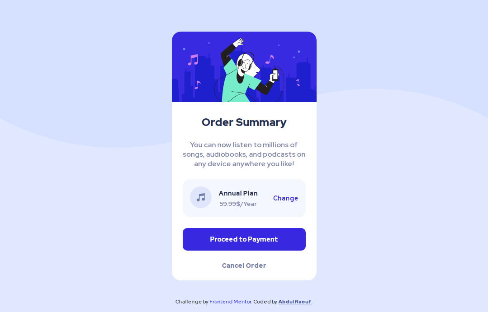

# Frontend Mentor - Order summary card solution

This is a solution to the [Order summary card challenge on Frontend Mentor](https://www.frontendmentor.io/challenges/order-summary-component-QlPmajDUj)

## Table of contents

- [Frontend Mentor - Order summary card solution](#frontend-mentor---order-summary-card-solution)
  - [Table of contents](#table-of-contents)
  - [Overview](#overview)
    - [Screenshot](#screenshot)
    - [Links](#links)
    - [Built with](#built-with)
  - [Author](#author)

## Overview

### Screenshot

### Links

- Solution URL: [Add solution URL here](https://github.com/raoufrofi/frontend-mentor-4th-project)
- Live Site URL: [Add live site URL here](https://raoufrofi.github.io/frontend-mentor-4th-project/)

### Built with

- Semantic HTML5 markup
- CSS custom properties
- Flexbox
- Sass/Scss
- Mobile-first workflow

## Author

- Frontend Mentor - [@AbdulRaouf](https://www.frontendmentor.io/profile/Abdul-Raouf-33);
